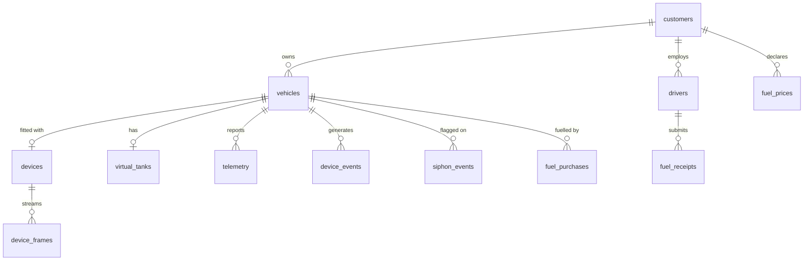

# Data model

Only the tables that carry real meaning are described here. The full schema
lives in `backend/src/db/schema.ts`.

## vehicles

Beyond the obvious registration fields, four columns drive most of the product:

| Column | Meaning |
| --- | --- |
| `consumption_rate_l_per_100km` | The rate **every** modelled litre is charged at |
| `idle_burn_rate_l_per_hour` | Charged to engine-on time that covered no ground |
| `rate_source` | `preset` (class guess) vs a figure entered or calibrated |
| `speed_limit_kph` | Above this the vehicle is overspeeding. NULL = none declared |

`rate_source` exists so the UI can distinguish "we guessed 7 km/L from the
model name" from "the manager typed 15 mpg off the dash". Those are very
different levels of confidence and were previously indistinguishable.

`odometer_baseline_km` and `odometer_baseline_device_km` together anchor true
mileage: the tracker only counts distance since it was fitted, so real mileage
is the baseline plus whatever the device has counted since the anchor instant.

## telemetry

One row per decoded reading. The columns that need explaining:

- **`fuel_level_liters`** — the *modelled* tank level, not a sensor reading.
- **`burn_ml`** — fuel charged to this specific hop by the tank model. Summing
  this column is exact and order-independent, which differencing
  `fuel_level_liters` is not: that column is rounded to 2 dp and the series is
  not monotonic once ordered by device timestamps, so counting every down-step
  while discarding every up-step over-reports.
- **`fuel_source`** — provenance. Values in `FUEL_MARKER_SOURCES`
  (`calibration`, `receipt`) mark **level markers, not consumption**. Every
  consumption query must skip them.

### Why marker rows exist

A tank calibration from 29.95 L to 20.00 L is a 9.95 L step change. Without a
marker it looks exactly like burn — and it fell in the gap between the refuel
guard (a rise of ≥5 L) and the siphon guard (a drop of ≥12 L while parked), so
it was silently counted as consumption. A driver report once showed **10.0 L
against 0 km and 0 trips** for exactly this reason.

Markers also carry the **last known odometer**, never NULL. The distance CTEs
read the previous odometer with `LAG` over every row, and a NULL breaks that
chain and silently drops one hop of travel.

## device_frames

The raw archive: `imei`, `received_at`, `event_id`, `io_raw` (JSON), `gps_raw`
(JSON). Keyed by IMEI — the device, not the vehicle it happens to be fitted to
— so re-fitting a tracker does not rewrite history.

This table is why [Driving events](/data/driving-events) can be recomputed for
the past.

## device_events

Harsh manoeuvres, overspeeding and any device-emitted scenario event, in one
table with a shared shape:

| Column | Notes |
| --- | --- |
| `event_type` | `harsh_braking`, `harsh_cornering`, `harsh_acceleration`, `overspeeding`, … |
| `value` + `unit` | m/s² for harsh manoeuvres, km/h for overspeeding |
| `severity` | `info`, `warning`, `critical` |
| `occurred_at` | Device time, not receive time |

Overspeed rows may come from either the derived sweep or a device-emitted
AVL 255. Both carry the peak speed in `value`, and the sweep will not write a
stretch the device already reported in the same minute.

## fuel_prices

Effective-dated benchmark prices, **never edited in place**. Setting a new
price opens a new period and leaves every earlier period valued at the price
that actually applied. See [Fuel pricing](/data/pricing).

## virtual_tanks

The anchored state behind the modelled level:

- `modelled_burn_ml` — monotonic lifetime counter
- `anchor_liters` / `anchor_modelled_ml` — the last calibration point
- `last_odometer_m` — where the model last charged from

Level is derived as `anchor_liters − (modelled_burn_ml − anchor_modelled_ml)`,
so re-anchoring is a single write rather than a rewrite of history.
