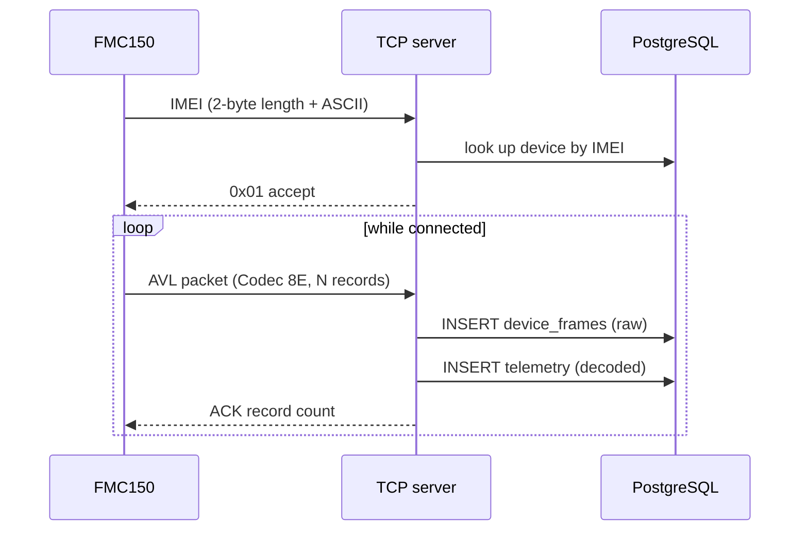
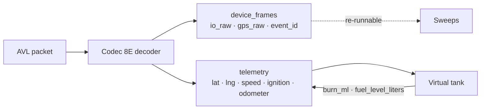

# Ingest path

## The wire protocol

Teltonika devices connect over raw TCP and speak **Codec 8 Extended**. A
session opens with an IMEI handshake, then the device streams AVL data packets
and waits for an acknowledgement of each.



**The acknowledgement matters.** A device that does not receive an ACK holds
the records in its internal buffer and re-sends them. That is the behaviour you
want — nothing is lost across a GSM dropout — but it means the ingest path must
be tolerant of the same record arriving twice.

## What each record contains

An AVL record is a timestamp, a GNSS block and a set of **IO elements** keyed
by AVL id:

```
timestamp        ms since epoch, UTC, from the device clock
priority         0 low, 1 high, 2 panic
GNSS block       longitude, latitude, altitude, angle, satellites, speed
event id         the IO element that triggered this record (0 = periodic)
IO elements      id → value, grouped by width (1, 2, 4, 8 bytes)
```

The **event id** is the interesting field: a record with event id 239 was
triggered by an ignition change, one with 0 is a routine periodic report. Only
event ids 0, 239 and 240 have ever been observed on the reference fleet —
scenario events like green driving (253) and overspeeding (255) require those
scenarios to be switched on in the Teltonika Configurator.

## Two tables, on purpose

Every frame is written twice:

**`device_frames`** keeps the raw decoded payload — `io_raw` as JSON,
`gps_raw` as JSON, the event id, the IMEI and the receive time. Nothing is
discarded. This is what makes it possible to enable a new AVL element in the
Configurator and immediately see it in the app without a backend change, and
what lets a detection rule be re-run over history.

**`telemetry`** keeps the decoded, per-vehicle columns the product actually
queries: position, speed, ignition, odometer, modelled fuel level. This is the
table every dashboard query reads.



## Timestamps

Device timestamps are UTC milliseconds. Everything is **stored** in UTC and
**reported** in `Africa/Lagos`.

This distinction has bitten before. A query that groups by `recorded_at::date`
groups by the *UTC* date, which files the first hour of every Lagos day under
the previous one — so a table heading disagrees with the tab above it. Any
grouping by day must use `DATE(recorded_at AT TIME ZONE 'Africa/Lagos')`, and
the shared helpers in `telemetry-deltas-sql.ts` do exactly that.

See [Distance and time windows](/data/distance) for the related trap with
rolling versus calendar windows.

## Device clock drift

Records carry the device's own timestamp, not the server's receive time. A
tracker that has been powered off can flush a backlog whose timestamps are
hours old, arriving all at once. Anything that assumes "newest received =
newest recorded" will be wrong during that flush, which is why ordering is
always by `recorded_at` and never by insertion order.
