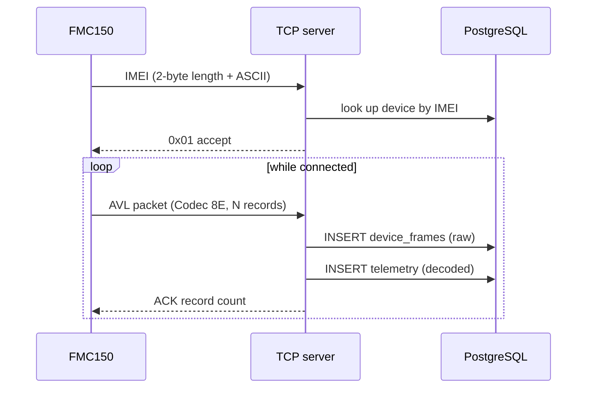
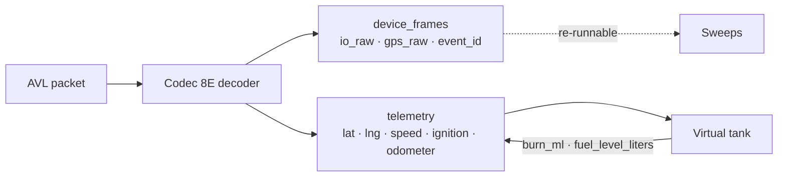

# Ingest path

## The wire protocol

Teltonika devices connect over raw TCP and speak **Codec 8 Extended**. A
session opens with an IMEI handshake, then the device streams AVL data packets
and waits for an acknowledgement of each.



**The acknowledgement matters.** A device that does not receive an ACK holds
the records in its internal buffer and re-sends them. That is the behaviour you
want — nothing is lost across a GSM dropout — but it means the ingest path must
be tolerant of the same record arriving twice.

## Record layout

An AVL record is a fixed header, a GNSS block, then a set of **IO elements**
keyed by AVL id.

| Field | Bytes | Notes |
| --- | --- | --- |
| Timestamp | 8 | Milliseconds since epoch, UTC, from the **device** clock |
| Priority | 1 | 0 low, 1 high, 2 panic |
| Longitude | 4 | Signed, 1e-7 degrees |
| Latitude | 4 | Signed, 1e-7 degrees |
| Altitude | 2 | Metres |
| Angle | 2 | Course over ground, degrees |
| Satellites | 1 | Count in the fix |
| Speed | 2 | km/h |
| Event id | 2 | **1 byte in Codec 8 — this is the 8E difference** |
| Total IO | 2 | How many elements follow, across all groups |

Then the IO groups, in order of value width:

```
N1  count(2) then count × [ id(2), value(1) ]
N2  count(2) then count × [ id(2), value(2) ]
N4  count(2) then count × [ id(2), value(4) ]
N8  count(2) then count × [ id(2), value(8) ]
NX  count(2) then count × [ id(2), length(2), value(length) ]
```

:::warning The NX group is why we decode this ourselves
`@groupe-savoy/teltonika-sdk` mis-slices records once a packet contains a
variable-length (NX) element: it hands the IO parser a buffer that already
begins part-way through the *previous* record's value, so the walk reads ASCII
text as an element count and runs off the end of the buffer.

Patching the group parser cannot fix a wrong record boundary, which is why three
attempts at it failed. `lib/codec8e-decoder.ts` replaces the record walk
entirely and is validated against a real 1086-byte FMC150 packet: 6 records,
179 bytes each, every record's declared `totalIo` matching the decoded element
count, ending exactly on the 5-byte trailer.
:::

## The event id

The `event id` names **which IO element triggered this record**. A record with
event id 239 was sent because the ignition changed; event id 0 is a routine
periodic report.

This is the single most diagnostic field in the protocol, because it tells you
what the device has been *configured to care about*. On the reference fleet only
**0, 239 and 240** have ever arrived. Everything else — trip (250), idling
(251), green driving (253), overspeeding (255), jamming, towing, crash — requires
its scenario to be switched on in the Teltonika Configurator, and none are.

```sql
SELECT event_id, count(*) FROM device_frames GROUP BY 1 ORDER BY 2 DESC;
```

If that query returns only three rows, no amount of backend work will populate
the driving-behaviour feed from device events — which is exactly why FuelSense
[derives those events from GPS](/data/driving-events) instead.

## The IO elements, in detail

Values arrive as **raw integers with an implied divisor**. Getting the scaling
wrong is silent: an unscaled fuel rate reads as 247 L/h rather than 2.47, which
looks like a catastrophic leak rather than a normal idle.

These are the 15 the reference FMC150 actually transmits.

### Movement and distance

| AVL | Element | Raw | Scale | Meaning |
| --- | --- | --- | --- | --- |
| 16 | Total odometer | metres | ÷1000 → km | Distance **since the tracker was fitted**, not the dashboard odometer |
| 199 | Trip odometer | metres | ÷1000 → km | Resets to zero at the start of each trip |
| 24 | Speed | km/h | — | GNSS ground speed |
| 240 | Movement | 0/1 | — | The device's own motion decision |

**AVL 16 is the backbone of the whole product.** Every modelled litre and every
naira is distance × a rate, so distance accuracy sets the ceiling on everything
else. It is validated against the vehicle's own dashboard odometer to within
0.03%.

:::danger Read metres, not the rounded kilometre column
AVL 16 arrives in metres. An earlier version read a rounded `odometer_km`
column, which made every delta a 0 or a 1 — and the speed cap then clipped each
integer flip to a fraction of a kilometre. **A day of 10.9 real km was reported
as 5.**
:::

AVL 240 also sets the **reporting rate**: moving sends frequently, stopped drops
to roughly one record an hour. That is why a parked vehicle's trail is sparse,
and why a manoeuvre detector must reject long sample gaps rather than
interpolating across them.

### Engine state

| AVL | Element | Raw | Meaning |
| --- | --- | --- | --- |
| 239 | Ignition | 0/1 | Key on and engine live |
| 449 | Ignition on counter | count | Times switched on since last device reset |

**AVL 239 does more work than any other boolean in the system.** It opens and
closes trips, it separates idling (engine on, not moving) from parked (engine
off, not moving), and it gates the fuel model — an engine-off hop is charged
nothing at all.

There is no AVL 250 (trip start/stop), so trips are segmented from 239's edges.

### Fuel — diagnostics only

| AVL | Element | Raw | Scale | Status |
| --- | --- | --- | --- | --- |
| 12 | Fuel used (GPS) | millilitres | ÷1000 → L | **Does not drive the tank** |
| 13 | Fuel rate (GPS) | L/h ×100 | ÷100 → L/h | **Does not drive the tank** |

Neither is measured. There is no fuel sensor and no CAN link; the firmware
derives both from GPS movement plus consumption parameters set in the
Configurator. With those parameters left at defaults, the output is meaningless:

- AVL 12 counted **13 ml across 3.55 km** of real driving
- AVL 13 reported a **constant ~2.47 L/h** whether moving, idling, or with the
  engine off

They contradict each other and neither describes the vehicle, so the tank is
[modelled instead](/data/fuel-model). Both are still ingested and shown as
diagnostics — they are useful for telling whether the Configurator profile has
been set, and useless for anything else.

AVL 12 is also a **running total that restarts at zero when the device loses
power**. Anything reading it must use increases, never the absolute value.

### GNSS quality

| AVL | Element | Scale | Good | Bad |
| --- | --- | --- | --- | --- |
| 69 | GNSS status | states | `2` = on, fix | `1` = on, no fix |
| 181 | PDOP | ÷10 | below 2 | above 5 |
| 182 | HDOP | ÷10 | below 1 | above 5 |

HDOP is the horizontal component — the part that decides where the vehicle sits
on the map. These are the fields to check first when a track looks like it
teleported: a poor-quality fix is a bad reading, not a driver doing something
strange.

`gps_valid` gates heading in particular. Heading without a valid fix is
**unknown**, not "due north" — feeding a stale 0° into a turn calculation
invents hairpin corners that never happened.

### Network and power

| AVL | Element | Notes |
| --- | --- | --- |
| 21 | GSM signal strength | 0–5. Low signal does **not** lose data |
| 241 | GSM operator | `62130` = MTN Nigeria |
| 68 | Battery current | mA into/out of the backup cell. 0 is normal on vehicle power |
| 200 | Sleep mode | Deeper sleep preserves the vehicle battery but reports less often |

Low signal is worth understanding properly: the tracker **buffers records and
flushes them in a burst** once it reconnects. Data arrives late, not never —
which is why the ingest path has to tolerate the same record twice, and why
ordering is always by `recorded_at` rather than insertion order.

:::note What is not sent
**66** (external voltage), **67** (backup battery voltage) and **113** (battery
level) are *not* transmitted — only 68. Full power diagnostics therefore needs a
Configurator I/O change, not code. And there is **no CAN/OBD group at all**
(nothing in 30, 48, 89, 270, 389, 390), so engine RPM, coolant, load and tyre
pressure are impossible without an LV-CAN200 / ALL-CAN300 adapter or TPMS
sensors.
:::

## Unknown elements are kept, not dropped

An AVL id with no entry in `lib/avl-catalogue.ts` still reaches the UI as
`AVL <id>` with its raw value. Combined with `device_frames.io_raw` holding the
whole payload, that means **enabling a new element in the Configurator surfaces
it in the API with zero backend work** — only bespoke UI for it needs writing.

## Sentinel values

Some elements report error codes in the same range as readings. Teltonika's BLE
temperature slots return `32767` for "sensor not found", which scaled naively
renders as a confident **327.67 °C**. The catalogue declares these explicitly:

| Raw | Means |
| --- | --- |
| 32767 | No sensor |
| 32768 | Sensor error |
| 32769 | Value not read |

Any new element with an error range needs its sentinels declared, or the UI will
present a fault code as a measurement.

## Two tables, on purpose

Every frame is written twice:

**`device_frames`** keeps the raw decoded payload — `io_raw` as JSON,
`gps_raw` as JSON, the event id, the IMEI and the receive time. Nothing is
discarded. This is what makes it possible to enable a new AVL element in the
Configurator and immediately see it in the app without a backend change, and
what lets a detection rule be re-run over history.

**`telemetry`** keeps the decoded, per-vehicle columns the product actually
queries: position, speed, ignition, odometer, modelled fuel level. This is the
table every dashboard query reads.



## Timestamps

Device timestamps are UTC milliseconds. Everything is **stored** in UTC and
**reported** in `Africa/Lagos`.

This distinction has bitten before. A query that groups by `recorded_at::date`
groups by the *UTC* date, which files the first hour of every Lagos day under
the previous one — so a table heading disagrees with the tab above it. Any
grouping by day must use `DATE(recorded_at AT TIME ZONE 'Africa/Lagos')`, and
the shared helpers in `telemetry-deltas-sql.ts` do exactly that.

See [Distance and time windows](/data/distance) for the related trap with
rolling versus calendar windows.

## Device clock drift

Records carry the device's own timestamp, not the server's receive time. A
tracker that has been powered off can flush a backlog whose timestamps are
hours old, arriving all at once. Anything that assumes "newest received =
newest recorded" will be wrong during that flush, which is why ordering is
always by `recorded_at` and never by insertion order.
