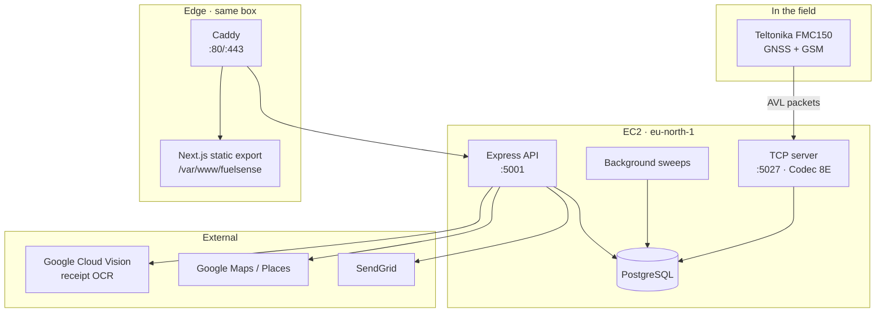

# System architecture

FuelSense is three processes and one database.

## The processes

**TCP server** (`src/tcp-server.ts`) holds long-lived connections from
trackers, speaks Teltonika Codec 8E, and writes every frame to the database.
It is deliberately thin: a frame must never wait on analysis to be persisted,
because a dropped frame cannot be recovered and an analysis can always be
re-run.

**Express API** (`src/server.ts`) serves the dashboard, the driver app and the
OpenAPI docs. It owns no state beyond the database.

**Background sweeps** run inside the API process on timers:

| Sweep | Does |
| --- | --- |
| Driving events | Finds harsh manoeuvres and overspeed stretches in stored frames |
| Receipt sweep | Matches late-arriving evidence to receipts; flags forecourt stops with no receipt |
| Route sweep | Compares trips against the route they were expected to take |
| Daily report | Emails yesterday's driving per driver as a PDF |

Sweeps are **idempotent by design**. Each one can re-run over the same period
without duplicating what it wrote, which is what makes it safe to widen a
lookback window or replay history after a bug fix.

## Why analysis is a sweep, not a hook

A harsh brake cannot be judged from the frame it happens in — the detector
needs the sample *after* the one being judged to know the speed changed. More
importantly, derivation rules change: thresholds get tuned, bugs get fixed, and
a fleet declares a speed limit months after the driving happened.

Anything computed at ingest time is frozen at the moment it was written. Anything
computed by a sweep over stored frames can be recomputed for the whole history.
That is why `device_frames` keeps the raw AVL payload rather than only the
decoded columns.

## Trust boundaries

- The customer is always taken from the **JWT**, never from a request
  parameter. No endpoint accepts a customer id.
- Google API keys stay server-side. Places, Static Maps and Street View are
  proxied through `/api/places/*` so the key never reaches a browser, and the
  calls are metered because they are billed per request.
- Driver tokens are a separate scheme from manager tokens and are not
  interchangeable.

## Deployment shape

The production host is a single EC2 instance in `eu-north-1` running Postgres
locally, with Caddy terminating TLS in front of both the API and the frontend.
The frontend is a **static export** — every route prerenders, so there is no
second Node process to keep alive. See [Deployment](/operations/deployment).

The tracker streams to that EC2 host directly — **not** to a developer laptop —
so a device that appears silent locally is usually reporting fine to production.
