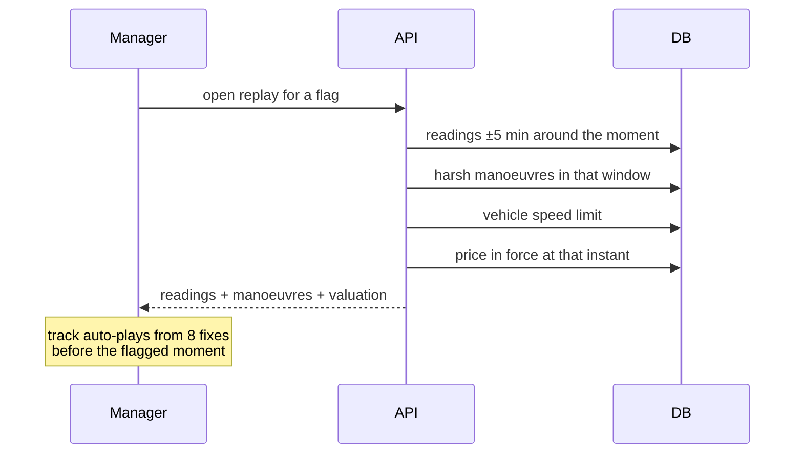

# Anomalies and evidence

An anomaly in FuelSense is **an invitation to investigate, never a verdict**.
Every flag ships with the telemetry behind it so a manager can judge for
themselves, and the product's language is built around that.

## What can honestly be claimed

The tank is [modelled](/data/fuel-model), not sensed. That constrains what a
fuel anomaly can mean:

- A drop while the engine is **off** is *unaccounted for* — the model charges
  nothing at all to an engine-off hop, so the expected figure is zero.
- It is **not** measured loss. No sensor watched fuel leave the tank.

The replay panel states this directly rather than implying a sensor reading.

## What was removed, and why

Earlier versions of the replay asserted things no data supported. They are worth
recording so they do not come back:

| Claim shown | Problem |
| --- | --- |
| "Stable OBD fuel readings in replay window" | There is no OBD. The level is modelled. |
| Signal row labelled `Fuel (OBD)` | Same. |
| "Detection confidence rising: 45% → 75% → 82%" | The final score × 0.45 and × 0.75. Not computed from evidence. |
| "Normal fuel drift while parked: 0.1–0.3 L/hr" | A constant string, not this vehicle's figure. |
| Six synthetic readings when the window was thin | Positions the vehicle was never recorded at, drawn on a map captioned "GPS TRACE". |

A sparse evidence window is now reported as sparse. That is a fact about the
evidence, and it is more useful than a padded chart.

## Confidence factors

Only facts checkable against the readings in the window appear:

```
3 GPS fixes across the drop window
Ignition logged OFF for the whole drop
Vehicle stationary throughout (0 km/h)
No refuel of 5L or more in this window
```

A factor that cannot be checked is not listed. The list is built per event, not
picked from a fixed set.

## The replay



Two details that matter:

**The window is centred on the event.** An earlier version applied `LIMIT` with
`ORDER BY recorded_at ASC` over a whole day, which takes the *earliest* readings
— on a day with 1,700 fixes that is the first 25 minutes. Clicking Replay on a
15:44 event produced a window ending at 12:00 with no cornering in it: evidence
for the wrong moment, which is worse than no evidence.

**Playback starts before the event.** Landing the scrubber exactly on the
flagged moment meant the manager arrived after the only thing worth watching had
happened.

## Detection thresholds

| Guard | Value | Purpose |
| --- | --- | --- |
| Refuel | rise ≥ 5 L | A genuine fill, not noise |
| Siphon candidate | drop ≥ 12 L while parked | Large enough to be worth a conversation |
| Marker rows | any `fuel_source` in `FUEL_MARKER_SOURCES` | Excluded from both — see below |

Calibration steps must be excluded from both guards. A 9.95 L calibration fell
between them and was counted as consumption, producing a driver report showing
10.0 L against 0 km.

## Receipt reconciliation

Receipts are matched against modelled tank rises. A mismatch is worth a
conversation, but the comparison is **modelled level versus declared volume** —
not sensor versus receipt — and the language reflects that:

> "Receipt claimed 40.0 L but the tank rose 28.5 L in the refuel window"

There is also a station check: was the vehicle actually at a filling station at
that time, according to the recorded track. Corroboration, not proof.

## Language rules

These are enforced in `trust-language.ts` and worth keeping:

- Flags are "for review", never "confirmed theft"
- Every flag carries "Investigation assist — not a final accusation"
- Recommended actions start with "walk through the replay before deciding"
- Modelled quantities are always labelled as modelled
