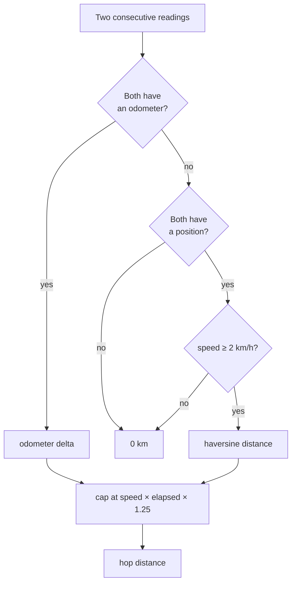

# Distance and time windows

Distance is the most trustworthy number in the system. It is also the input to
every modelled litre and every naira, so its edge cases matter more than they
look.

## How a hop is measured

For each pair of consecutive readings, distance is taken from the **odometer**
when both readings have one, and from a **GPS haversine** otherwise. Both are
capped by what the reported speed could physically cover in the elapsed time.



Two guards do the real work:

**The speed cap** rejects GPS jumps. A dropped satellite lock can place a
stationary vehicle a kilometre away and back, and without the cap that reads as
2 km of driving.

**The 2 km/h floor on GPS hops** rejects stationary jitter. A parked vehicle's
fix wanders continuously; summing that wander over a night produces phantom
kilometres.

Accuracy against the vehicle's own dashboard odometer has been validated to
within **0.03%**.

### Read metres, not kilometres

AVL 16 arrives in metres. An earlier version read the rounded `odometer_km`
column, which made every delta a 0 or a 1 — and the speed cap then clipped each
integer flip to a fraction of a kilometre. A day of 10.9 real km was reported as
5. The CTEs now read `odometer_m` and fall back to `odometer_km` only for rows
written before that column existed.

## Idle time

Idle is **ignition on and speed below 2 km/h**. It is derived server-side
because the device never sends AVL 251 (idling) with its scenarios off.

The gap between readings is capped at 600 seconds when accumulating idle. Without
that cap, a device offline overnight counts as one enormous idle stretch and the
morning report shows a vehicle that idled for nine hours.

## Calendar windows, not rolling ones

**`days` counts calendar days in `Africa/Lagos`, including today.** `days=1`
means since local midnight this morning.

This is not how it started, and the bug is worth remembering. The window used to
be `NOW() - N days`, which slides with the wall clock: at 14:30 on a Wednesday,
the "Today" tab reached back to 14:30 on Tuesday. A fleet that had not moved all
Wednesday was shown Tuesday afternoon's 28.6 km under a heading that said
*today*, while the table underneath — which grouped by date — correctly labelled
the same rows **TUE 11 AUG**. The panel disagreed with itself on screen.

Anchoring on local midnight also stops the boundary drifting through the day, so
two page loads an hour apart report the same "today".

```sql
-- The shared helper, from telemetry-deltas-sql.ts
((DATE(NOW() AT TIME ZONE 'Africa/Lagos') - ((days - 1) || ' days')::INTERVAL)
  AT TIME ZONE 'Africa/Lagos')
```

## Grouping by day

Always group with `DATE(recorded_at AT TIME ZONE 'Africa/Lagos')`, exported as
`localDate`. Casting `recorded_at::date` groups by the **UTC** date, and Lagos
runs an hour ahead — so the first hour of every local day gets filed under the
previous one.

## Trips

A trip opens on an ignition edge and closes after a rest period. Trip *counts*
in the daily aggregate come from counting those edges, which has one consequence
worth knowing:

> A stop where the driver cuts the engine splits one journey into two trips.

That is why the distance breakdown card shows a **typical trip** rather than a
longest one — per-trip distances only exist once readings are segmented by
`/telemetry/trips`, and mixing that endpoint's window with the aggregate's would
put two contradictory totals on the same screen.

Trip-start alerts are derived from ignition edges too, because the device sends
no AVL 250.
