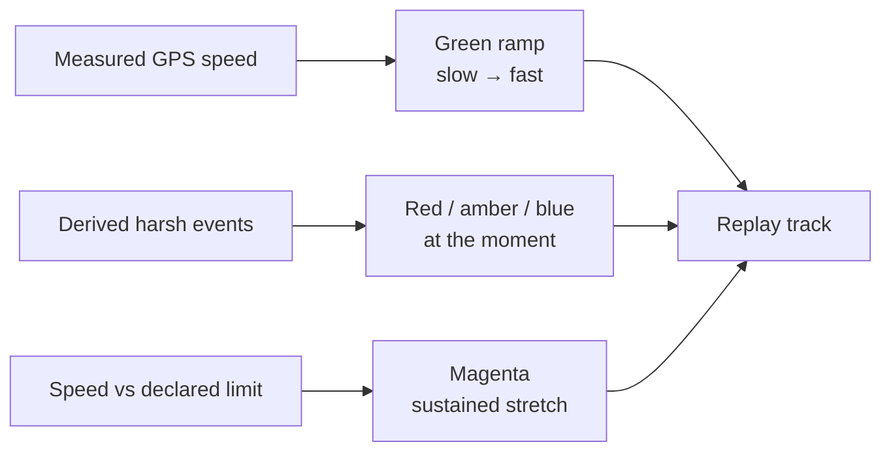

# Driving events

Harsh braking, harsh acceleration, harsh cornering and overspeeding are all
**derived from the GPS speed and heading series**. The tracker reports none of
them: its Eco/Green Driving and Overspeeding scenarios are switched off on the
reference fleet, and it has never emitted event 253 or 255.

:::info Say where a flag came from
A flag that reads "Tracker reported harsh cornering" credits the device with a
judgement it never made. A manager weighing an accusation against a driver
deserves to know whether a number was reported by hardware or computed from
position — the product says "derived from the GPS speed trace" for exactly this
reason.
:::

## The physics

```
longitudinal acceleration = Δspeed / Δt
lateral acceleration      = speed × rate of heading change
```

That part is easy. The care is in refusing to call a GPS artefact a driving
fault.

## The guards

| Guard | Value | Why |
| --- | --- | --- |
| Minimum sample gap | 0.5 s | Sub-second deltas divide by almost nothing and explode |
| Maximum sample gap | 5 s | A longer gap says nothing about the second inside it |
| Implausible delta | 40 km/h per second | Beyond this the fix is wrong, not the driver |
| Cornering speed floor | 15 km/h | Heading is noise when barely moving — a parked vehicle "turns" randomly |

Heading without a valid GNSS fix is treated as **unknown**, not as due north.
Feeding a stale 0° into a turn calculation invents hairpins.

## Thresholds

| Event | Default | Note |
| --- | --- | --- |
| Harsh acceleration | 2.5 m/s² | ~0.25 g — firm enough to spill a drink |
| Harsh braking | 3.0 m/s² | Judged harder: it is the one that precedes collisions |
| Harsh cornering | 3.0 m/s² lateral | |
| Severe multiple | 1.5× | Above this an event is `critical` rather than `warning` |

All are overridable by environment variable.

## One manoeuvre, one event

Consecutive samples over a threshold are merged into a single event, and the
**peak** magnitude of the stretch is what gets recorded. A driver who brakes
hard for three seconds did one thing wrong; reporting three violations would
distort any score built on the count.

Separate runs are kept per type, so a hard brake taken through a corner is
reported as both without either swallowing the other.

## Overspeeding

Overspeeding needs one thing the platform cannot derive: **a limit**.

Set it per vehicle with `POST /vehicles/{id}/speed-limit`, matching whatever is
configured on the tracker. With no limit declared, no overspeeding is reported —
the platform will not pick a threshold on a fleet's behalf, because that would
be inventing policy.

Why store it here rather than read it from the device:

1. The tracker only emits AVL 255 when its **Overspeeding scenario** is enabled.
   A limit typed into the Configurator without that switch produces nothing.
2. A device-side event can never be recomputed for a drive that already
   happened. A stored limit can be applied to history.

### What counts as a stretch

| Setting | Default | Why |
| --- | --- | --- |
| Margin over the limit | 5 km/h | A fix reading 101 against a 100 limit is inside the error bar |
| Minimum dwell | 10 s | A single spike is one bad fix, not speeding |
| Critical at | 120% of the limit | A drift over is a different conversation from 20% over |

A stretch never spans a reporting gap. An hour offline would otherwise read as
an hour of speeding.

If the device *does* start emitting AVL 255, both sources land in the same
table with the peak speed in `value`, and the derived sweep will not duplicate a
stretch the device already reported in the same minute.

## The replay track

The evidence replay colours the map from what is known:



Overspeeding is shaded from the **plotted speeds** rather than from an event
index, because it is a stretch rather than a moment — an event marker would
light one segment of a two-minute run and leave the rest looking lawful. A harsh
manoeuvre is the more specific claim about its instant, so it wins over the
overspeed colour beneath it.

The legend shows only the manoeuvre types actually present in that window, never
a list of what the system could theoretically detect.

## Re-running over history

Detection is a sweep over `device_frames`, not a hook at ingest. It is
idempotent — a manoeuvre already recorded within a minute of the same second is
not written twice — so the pass can safely re-run over the same fortnight, and
the lookback window can be widened after a threshold change.
