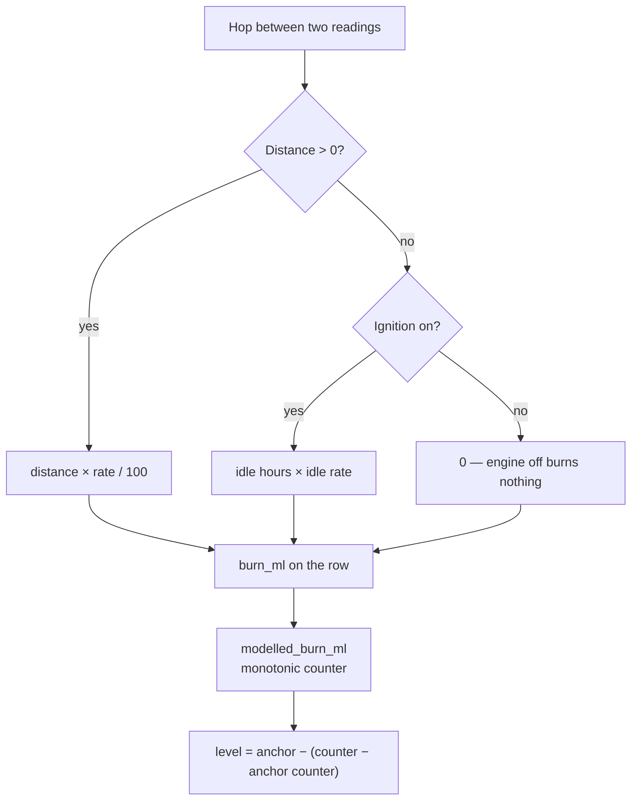

# The fuel model

:::warning The tank is an estimate
The fuel level FuelSense shows is **modelled from distance and idle time**, not
read from a sensor. It must never be labelled a measurement anywhere in the
product. This page explains what the model can and cannot tell you.
:::

## How a litre is charged

Every hop between two readings is charged exactly once:

```
if the hop covered ground:
    burn = distance_km × consumption_rate_l_per_100km / 100
else if the engine was on:
    burn = idle_hours × idle_burn_rate_l_per_hour
else:
    burn = 0
```

Never both — charging distance *and* idle on the same hop double-bills a
vehicle crawling in traffic. Rates are read from the **vehicle record** on every
reading, so a change on the calibration screen takes effect immediately rather
than from the next trip.



The level itself is **anchored**, not accumulated: a calibration sets
`anchor_liters` and `anchor_modelled_ml` together, and the level is derived from
the difference. Re-anchoring is one write, not a rewrite of history.

## Why the model replaced the device's own figure

The tank used to run on AVL 12, the device's fuel accumulator. It read roughly
**5× too full and drifted further every trip**.

The reason is covered in [What the hardware sends](/data/avl-elements): AVL 12
counted 13 ml across 3.55 km, while AVL 13 reported a constant 2.47 L/h with the
engine off. Neither is measured; the firmware derives both from consumption
parameters that were never set in the Configurator. Replayed over a real 3.6 km
drive with 9.1 minutes of idling, AVL 12 gave **0.145 L** where the model gives
**0.742 L** at 15 mpg.

The proper fix remains setting those Configurator parameters. Until then, the
model is the honest option, and both elements are retained as diagnostics.

## The tautology to avoid

This is the trap that matters most when building UI on top of the model.

> Economy computed as `distance ÷ modelled litres` is **circular**. It returns
> the rate you entered, minus an idle penalty. It can never disagree with the
> vehicle's own settings, so it cannot *measure* efficiency.

A dashboard once showed "Economy 12.6 mpg vs benchmark" for a vehicle
configured at 15 mpg. The 12.6 was not a finding — it was 15 mpg diluted by that
period's idling, dressed up as a measurement and compared against a benchmark as
if it could fail.

The same two numbers do say something real once the idle share is split out:

```
rated economy    = distance ÷ (modelled litres − idle litres)   ← what you entered
effective economy = distance ÷ modelled litres                   ← after idling
idle drag         = rated − effective
```

**Idle drag is actionable.** It says "idling cost you 2.4 mpg and 1.9 L this
period", which a manager can do something about. That is what the product shows
in place of the circular economy figure.

## Marker rows

Two events change the level without being consumption: a **calibration** and a
**receipt credit**. Both are written as `telemetry` rows carrying
`fuel_source` in `FUEL_MARKER_SOURCES`, and every consumption query skips them.

Without this, a calibration from 29.95 L to 20.00 L was counted as 9.95 L of
burn — it slipped between the refuel guard (a rise of ≥5 L) and the siphon guard
(a drop of ≥12 L while parked). The symptom was a driver report showing **10.0 L
against 0 km and 0 trips**.

Markers carry the **last known odometer**, never NULL, because the distance CTEs
chain `LAG(odometer)` across every row and a NULL silently drops a hop.

:::note Historical data
A calibration made before marker rows existed landed on an ordinary row and is
not retroactively taggable. Older calibrations still read as burn unless
backfilled individually from `virtual_tanks.calibrated_at`.
:::

## Benchmarks must include idle

Expected fuel for a period has to include an idle allowance. Comparing
idle-inclusive modelled burn against a driving-only benchmark flags **every**
driver who sat in traffic, which is every driver in Lagos or Abuja.
