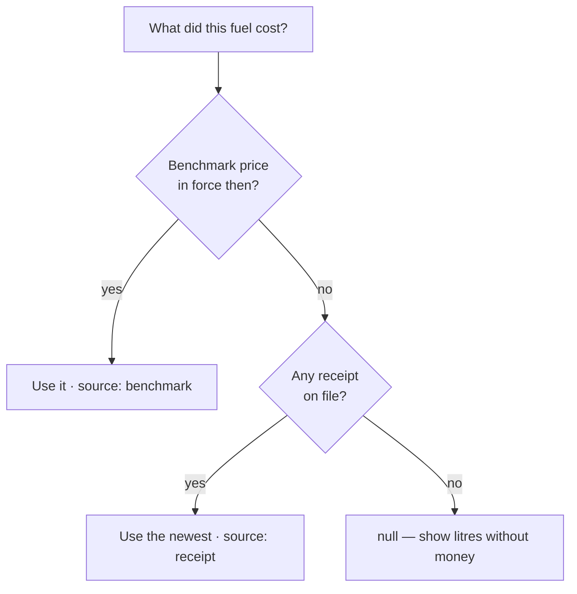

# Fuel pricing

Every naira figure in FuelSense is modelled litres multiplied by a price per
litre. Getting that price right is therefore not a detail — it is half of every
money figure on screen.

## The rule

**A period is valued at the price that was in force at the time.**

Not at today's price, and never at a compiled-in constant.



That `null` is deliberate. When a fleet has recorded no price at all, the API
returns no money figure and the UI shows quantities alone. Substituting a
default would put a number on screen that looks like a finding and is actually
an assumption.

## Two kinds of price

**Receipts** are the authority on *actual spend*. A receipt says what one driver
paid at one pump on one day, and for valuing that specific transaction it beats
any fleet-wide rate.

**Benchmark prices** answer "what should this fleet be spending per kilometre".
They are a figure the manager controls, because Nigerian pump prices move faster
than receipts accumulate.

Benchmark periods are **effective-dated and never edited in place**. Setting a
new price opens a new period and leaves every earlier period valued at the price
that actually applied. Back-dating is allowed so a missed change can be recorded
after the fact.

## Blended rates

When a window spans a price change, the headline total is the sum of each day
valued at its own rate — so the caption must not quote a single price as if it
were the multiplier.

A week spanning ₦1,300 and ₦1,275 works out at ₦1,290.73/L. Captioning that
total "at ₦1,275/L" misrepresents it. The UI derives the blended rate from the
cost the backend already computed:

```
blended price = total cost ÷ total litres
```

## Where a flat ₦1,300 used to leak in

The constant `DEFAULT_FUEL_PRICE_NGN_LITER = 1300` still exists as a last-resort
fallback in several modules. It has been removed from the paths where it was
actively misleading:

| Path | Before | Now |
| --- | --- | --- |
| Event replay loss valuation | Flat 1300 | `effectivePriceAt(customer, occurredAt)` |
| Receipt replay shortfall | `COALESCE(price_per_liter, 1300)` in SQL | Receipt's own price, else benchmark at that date |
| Estimated consumption | Flat 1300 for the whole window | Each day at that day's rate |
| Fleet efficiency | — | Already benchmark → receipt → constant |

:::caution Still using the constant
Idle detector, receipt sweep, driver report and several other modules still fall
back to the constant when a fleet has recorded no price. That is defensible as a
fallback, but worth a sweep if you want it gone everywhere.
:::

## Valuing a loss

An anomaly's naira impact uses the rate in force **when the loss occurred**, and
the response says which rate that was:

```json
{
  "liters_lost": 4.2,
  "estimated_loss_ngn": 5460,
  "price_ngn_per_liter": 1300,
  "price_source": "benchmark"
}
```

Naming the source lets a manager tell a benchmark they set from a price read off
a driver's receipt.

## Bought is not burned

Two different questions that must never be added together:

- **Bought** — receipts. Money that provably changed hands.
- **Burned** — modelled consumption. Fuel that left the tank.

A ₦15,000 fill against 11 km of driving is not a ₦1,364/km vehicle; most of that
fuel is still in the tank. Mixing them produced a fictional "overspend" figure,
and a day with no receipts once reported ₦52 of idling as a pump purchase.
