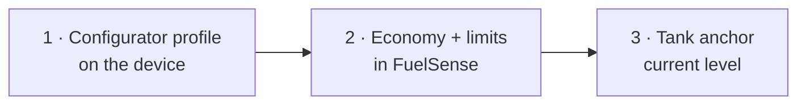

# Calibration

Three different settings share the word "calibration". Doing them out of order
wastes the work.



:::warning Order matters
Anchoring the tank **before** the Configurator profile is set anchors it to a
burn rate the device is about to stop using, and the anchor has to be thrown
away again.
:::

## 1. The Teltonika Configurator

Set on the device itself, with the Teltonika Configurator tool.

### Fuel consumption profile

| Field | Suggested | Note |
| --- | --- | --- |
| City consumption | 12.5 L/100 km | Referenced at 30 km/h |
| Average consumption | 10.0 L/100 km | Referenced at 60 km/h |
| Highway consumption | 8.5 L/100 km | Referenced at 90 km/h |
| Consumption on idling | 1.4 L/h | The default 1.0 is low for a 2.5 L with AC |
| Correction coefficient | 1 | Leave until two receipts disagree |

Leaving these at defaults is why AVL 12 emits garbage — see
[What the hardware sends](/data/avl-elements).

### I/O elements worth enabling

| Element | Priority | Gives you |
| --- | --- | --- |
| Fuel Used GPS (12) | Low | The burn accumulator, in ml |
| Fuel Rate GPS (13) | Low | Cross-check for the accumulator |
| External Voltage (66) | Low | Vehicle battery health |
| Battery Voltage (67) | Low | Tracker backup cell |
| Trip Odometer (199) | Low | Required by continuous counting |

Anything enabled here appears in `/telemetry/vehicle-signals` immediately, with
no backend change.

### Scenarios

Green Driving and Overspeeding are **off** by default. FuelSense derives both
from GPS regardless, so enabling them is optional — but if you do enable
Overspeeding, set the same limit in FuelSense so the two agree.

## 2. Settings in FuelSense

### Fuel economy

`Calibration → Fuel economy`, or `POST /vehicles/{id}/economy`.

Enter the long-term average from the vehicle's own trip computer. **The unit is
required, not assumed** — 15 mpg is 6.38 km/L on a US gallon and 5.31 on an
imperial one, a 20% gap in the figure the whole fuel model rests on.

This replaces the class preset. `rate_source` then reads something other than
`preset`, and the dashboard stops describing the figure as a guess.

### Speed limit

`Calibration → Speed limit`, or `POST /vehicles/{id}/speed-limit`.

Set it to the same limit configured on the tracker — for example `100`. Until
this is set, **no overspeeding is reported at all**; FuelSense will not choose a
threshold on your behalf.

```bash
curl -X POST https://api.fuelsense.ng/api/vehicles/$VEHICLE_ID/speed-limit \
  -H "Authorization: Bearer $TOKEN" \
  -H 'Content-Type: application/json' \
  -d '{"speedLimitKph": 100}'
```

Because detection runs over stored frames, setting a limit today also finds
overspeeding in the **past** — a device-side event never could.

### Odometer baseline

`POST /vehicles/{id}/odometer` with the dashboard reading. The tracker only
counts distance since it was fitted, so true mileage is this baseline plus the
device's counter since the anchor instant.

## 3. Tank anchor

`POST /vehicles/{id}/virtual-tank/calibrate` with the current level in litres —
ideally right after a fill, when the level is known exactly.

This writes a **marker row** so the step change is never counted as consumption
or mistaken for a siphon. See [The fuel model](/data/fuel-model).

Re-anchor whenever the modelled level and reality have visibly drifted apart.
The model has no feedback loop; it is only as good as its rates and its last
anchor.

## Verifying it took

```sql
SELECT license_plate,
       consumption_rate_l_per_100km,
       idle_burn_rate_l_per_hour,
       rate_source,
       speed_limit_kph
FROM vehicles;
```

Then check the estimate page: the **Your km/L** column should show the rate you
entered, not a model average.
