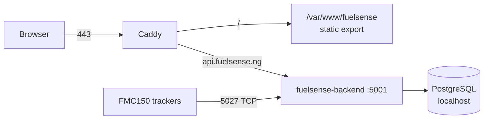

# Deployment

Both halves of FuelSense run on **one EC2 box in eu-north-1**, behind Caddy.

| Piece | Where | Served by |
| --- | --- | --- |
| API and TCP ingest | `/home/ec2-user/backend` | systemd `fuelsense-backend`, ports 5001 and 5027 |
| Marketing site and dashboard | `/var/www/fuelsense` | Caddy, static files |
| Database | same box | PostgreSQL |

The frontend is a static export (`output: 'export'` in `next.config.ts`), so
there is no Node process to keep alive for it.



## Why not Netlify

Netlify hosted the frontend until its team credits ran out mid-cycle, at which
point production deploys were silently skipped — the live site sat several
builds behind while still serving traffic, and nothing failed loudly. Moving to
the box that already runs the API removed the second bill and the second failure
mode.

## GitHub Actions

`deploy-backend.yml` runs on pushes touching `backend/`, `deploy-frontend.yml`
on pushes touching `frontend/`. Both verify before shipping and assert the
result answers afterwards.

Required repository secrets:

| Secret | Value |
| --- | --- |
| `EC2_SSH_KEY` | Private key contents — ideally a deploy-only key |
| `EC2_HOST` | The EC2 public hostname |
| `EC2_USER` | `ec2-user` |
| `GOOGLE_MAPS_API_KEY` | Same value as the server `.env` |
| `NEXT_PUBLIC_API_URL` | `https://api.fuelsense.ng/api` |

## Deploying by hand

Only needed when Actions is unavailable.

:::danger Always exclude .env
The server holds the production `.env`. Nothing in the repo should overwrite it —
an rsync without `--exclude .env` will point production at a dead database.
:::

```bash
rsync -av --delete \
  --exclude node_modules --exclude .git --exclude .env \
  backend/ ec2-user@$EC2_HOST:/home/ec2-user/backend/

ssh ec2-user@$EC2_HOST 'cd backend && npm ci && npm run build \
  && sudo systemctl restart fuelsense-backend'
```

## DNS and TLS

`fuelsense.ng`, `www.fuelsense.ng` and `api.fuelsense.ng` are A records pointing
at the EC2 elastic IP. Caddy issues and renews certificates itself once DNS
resolves to the box.

## Database

Production Postgres runs **on the EC2 box**, not on a managed provider. It was
moved off Neon when that project hit a quota lock, and it started empty — so
history before that migration does not exist in production.

:::caution Local .env
A developer laptop's `.env` may still point at the retired Neon instance. If
local queries return nothing while the dashboard shows data, check the
connection string before debugging the query.
:::

## Ports

| Port | Purpose | Exposure |
| --- | --- | --- |
| 443 | HTTPS via Caddy | Public |
| 5001 | Express API | Localhost only; Caddy proxies |
| 5027 | Teltonika TCP ingest | **Public** — trackers connect directly |
| 5432 | PostgreSQL | Localhost only |

Port 5027 must stay open in the security group. A tracker cannot fall back to
HTTP, and a closed port looks identical to a dead device from the dashboard.

## Verifying a deploy

```bash
curl -s https://api.fuelsense.ng/api/health
sudo journalctl -u fuelsense-backend -n 50 --no-pager
sudo ss -tlnp | grep -E '5001|5027'
```

Then check a frame has arrived recently:

```sql
SELECT imei, max(received_at) FROM device_frames GROUP BY 1;
```
