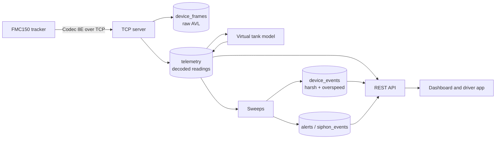

# FuelSense

FuelSense turns a Teltonika GPS tracker into a fuel accounting system for
Nigerian fleets. It answers four questions a fleet manager cannot otherwise
answer between fill-ups:

- how far did each vehicle actually go
- how long did it sit with the engine running and nothing moving
- roughly how much fuel did that use
- what did it cost, at the price that applied at the time

## The one thing to understand first

**The hardware has no fuel sensor and no engine link.**

The reference fleet runs Teltonika FMC150 trackers with no CAN adapter, no
OBD-II link and no capacitive fuel probe. That single fact shapes every design
decision in this system, and it is the difference between a figure you can act
on and a figure that is quietly invented.

What that means in practice:

| Quantity | Status | Where it comes from |
| --- | --- | --- |
| Position, speed, heading | **Measured** | GNSS, roughly one fix per second while moving |
| Ignition state | **Measured** | Digital input, AVL 239 |
| Distance | **Measured** | Device odometer (AVL 16), cross-checked against GPS |
| Idle time | **Derived** | Ignition on, speed below 2 km/h |
| Harsh braking / acceleration / cornering | **Derived** | Speed and heading series |
| Overspeeding | **Derived** | Measured speed vs a limit *you declare* |
| Fuel level and consumption | **Modelled** | Distance × your configured rate + idle × idle rate |
| Cost | **Modelled** | Modelled litres × the price in force at the time |
| Engine RPM, coolant, load, tyre pressure | **Not available** | Would need a CAN adapter or TPMS sensors |

Anything in the **Modelled** rows is an estimate and is labelled as one
throughout the product. It must never be presented to a user as a measurement —
see [The fuel model](/data/fuel-model) for why that distinction is not
pedantry but the difference between a useful tool and a misleading one.

## How a frame becomes a figure

Each stage is documented separately:

- [System architecture](/architecture/system) — the services and how they fit
- [Ingest path](/architecture/ingest) — TCP, Codec 8E and what gets stored
- [Data model](/architecture/data-model) — the tables that matter and why

## Where the accuracy questions are answered

Most support questions are really one of these:

- **"Why does it say I drove when I didn't?"** → [Distance and time windows](/data/distance)
- **"Why is the fuel figure wrong?"** → [The fuel model](/data/fuel-model)
- **"Where did this harsh braking flag come from?"** → [Driving events](/data/driving-events)
- **"Why is this priced at the wrong rate?"** → [Fuel pricing](/data/pricing)
- **"Is this actually theft?"** → [Anomalies and evidence](/data/anomalies)

## API reference

The full HTTP API is documented as an OpenAPI 3 document, browsable at
[`/api/docs`](https://api.fuelsense.ng/api/docs) on any running instance and available raw at [`/api/openapi.json`](https://api.fuelsense.ng/api/openapi.json)
for client generation.
